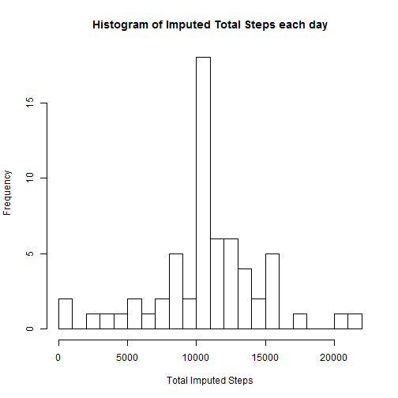
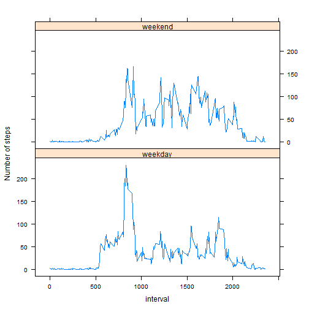

```r
library(knitr)
library(rmarkdown)
library(plyr)
library(dplyr)
library(utils)
opts_chunk$set(echo=TRUE)
```

## Loading and preprocessing the data

```r
fileUrl <- "http://d396qusza40orc.cloudfront.net/repdata%2Fdata%2Factivity.zip"
download.file(fileUrl, destfile="./repdata-data-activity.zip", mode="wb")
unzip("./repdata-data-activity.zip")
activity <- read.csv(file="./activity.csv")
```

## What is mean total number of steps taken per day?

```r
dailytotals <- ddply(activity, .(date), summarize, total_steps=sum(steps))
hist(dailytotals$total_steps, 
        breaks=25, 
        main="Histogram of Total Steps each day",
        xlab ="Total Steps")
```

 

```r
mean_daily_steps <- mean(dailytotals$total_steps, na.rm=TRUE)
print(mean_daily_steps)
```

```
## [1] 10766.19
```

```r
median_daily_steps <- median(dailytotals$total_steps, na.rm=TRUE)
print(median_daily_steps)
```

```
## [1] 10765
```

## What is the average daily activity pattern?

```r
intervaltotals <- ddply(activity, .(interval), summarize, avg_steps=mean(steps, na.rm=TRUE))
int_totals <- arrange(intervaltotals, as.numeric(interval))
with(int_totals, 
        plot(interval,avg_steps, type="l",
        main="Average steps during an interval",
        ylab= "Average steps"))
```

 

```r
interval_max_total <- int_totals[int_totals$avg_steps == max(int_totals$avg_steps),1]
print(interval_max_total)
```

```
## [1] 835
```

## Imputing missing values

```r
total_missing <- nrow(activity[!complete.cases(activity$steps),])
print(total_missing)
```

```
## [1] 2304
```

```r
# Imputing missing values to average steps per interval
activity_missing <- activity[!complete.cases(activity$steps),]
int_totals$avg_steps <- round(int_totals$avg_steps,0)
imputed_activity_missing <- join(activity_missing, int_totals, type="left")[, 2:4]
```

```
## Joining by: interval
```

```r
names(imputed_activity_missing) <- c("date","interval","steps")
imputed_activity <- arrange(rbind(activity[complete.cases(activity$steps),], imputed_activity_missing), date, interval)
imp_dailytotals <- ddply(imputed_activity, .(date), summarize, total_steps=sum(steps))
hist(imp_dailytotals$total_steps, 
        breaks=25, 
        main="Histogram of Imputed Total Steps each day",
        xlab ="Total Imputed Steps")
```

 

```r
imp_mean_daily_steps <- mean(imp_dailytotals$total_steps, na.rm=TRUE)
print(imp_mean_daily_steps)
```

```
## [1] 10765.64
```

```r
imp_median_daily_steps <- median(imp_dailytotals$total_steps, na.rm=TRUE)
print(imp_median_daily_steps)
```

```
## [1] 10762
```
#### The mean and median have not shifted much

## Are there differences in activity patterns between weekdays and weekends?

```r
imputed_activity$date <- as.POSIXct(imputed_activity$date)
imputed_activity$wday <- ifelse(weekdays(imputed_activity$date) %in% c("Sunday", "Saturday"), "weekend", "weekday")
imp_int_totals <- ddply(imputed_activity, .(wday, interval), summarize, avg_steps=mean(steps))

# panel plot
library(lattice)
xyplot(avg_steps~interval|factor(wday), data=imp_int_totals, type="l", layout=c(1,2), ylab="Number of steps")
```

 
 

