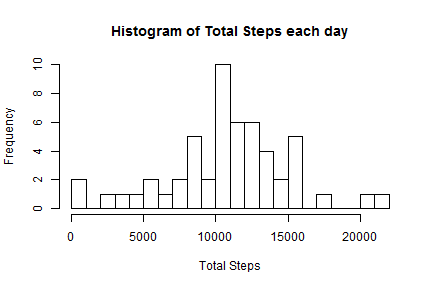
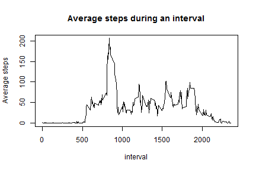

```r
library(knitr)
library(rmarkdown)
library(plyr)
library(dplyr)
library(utils)
opts_chunk$set(echo=TRUE)
```

## Loading and preprocessing the data

```r
fileUrl <- "http://d396qusza40orc.cloudfront.net/repdata%2Fdata%2Factivity.zip"
download.file(fileUrl, destfile="./repdata-data-activity.zip", mode="wb")
unzip("./repdata-data-activity.zip")
activity <- read.csv(file="./activity.csv")
```

## What is mean total number of steps taken per day?

```r
library(plyr)
dailytotals <- ddply(activity, .(date), summarize, total_steps=sum(steps))
hist(dailytotals$total_steps, 
        breaks=25, 
        main="Histogram of Total Steps each day",
        xlab ="Total Steps")
```

 

```r
mean_daily_steps <- mean(dailytotals$total_steps, na.rm=TRUE)
median_daily_steps <- median(dailytotals$total_steps, na.rm=TRUE)
```

## What is the average daily activity pattern?

```r
intervaltotals <- ddply(activity, .(interval), summarize, avg_steps=mean(steps, na.rm=TRUE))
int_totals <- arrange(intervaltotals, as.numeric(interval))
with(int_totals, 
        plot(interval,avg_steps, type="l",
        main="Average steps during an interval",
        ylab= "Average steps"))
```

 

## Imputing missing values


## Are there differences in activity patterns between weekdays and weekends?


